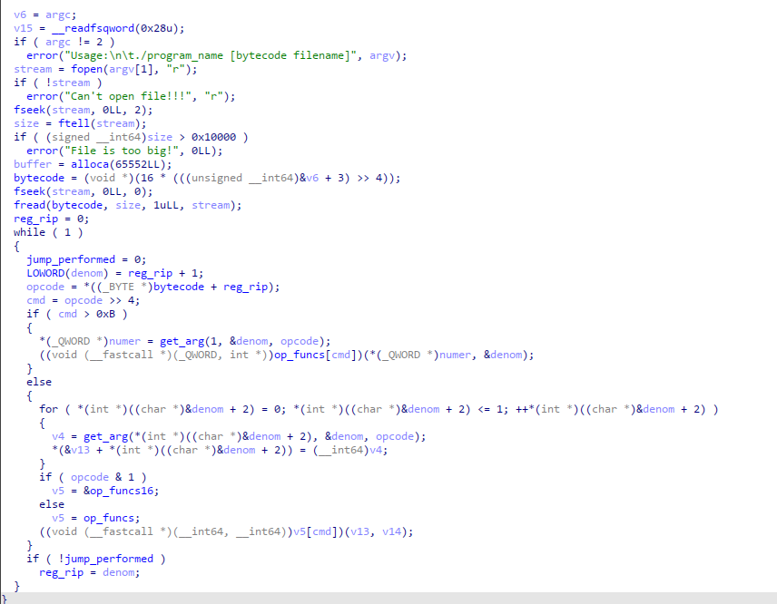
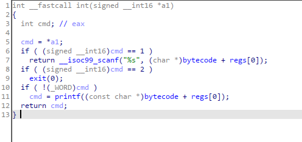
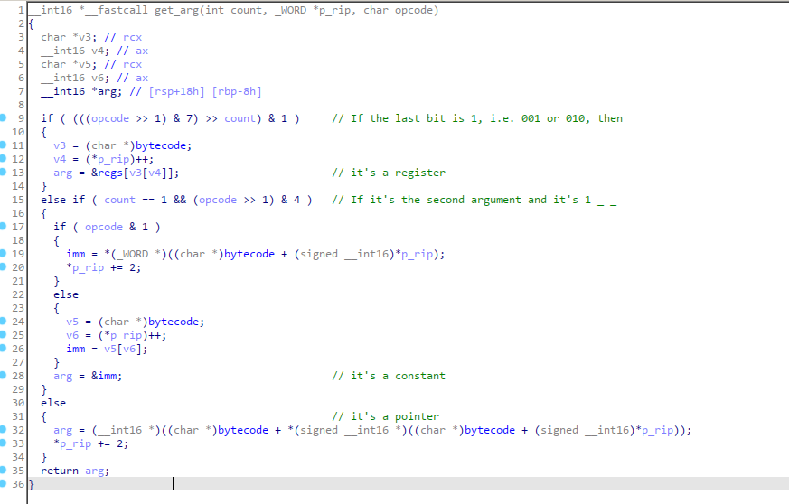
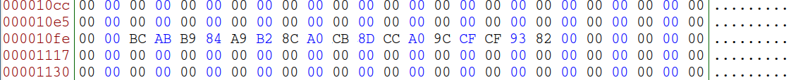

## vm_rev
> files: [vm_rev.file](src/vm_rev.file) [b1.file](src/b1.file)

This is a VM reverse engineering challenge.

First, let's see what the vm's program is:
```
$ ./vm_rev.file b1.file
Enter password:password
Wrong password!!!
```


Now let's get to reversing the virtual machine!

I used IDA to decompile the binary.

`main()`:



Here we can see the program load the bytecode into a buffer, then set a global `bytecode` pointer to point to it.

Then, in the `while ( 1 )` loop, the bytecode is being executed. I've tried to pick self-explanatory names for the variables in the code, so let's just figure out the execution loop.

1. Read a byte at `rip`, then get its 4 most significant bits (`cmd = opcode >> 4;`)
2. If `cmd` is lower than `0xC`, then it's a two-operand opcode  
3. Otherwise it's a one-operand opcode
4. Get the arguments for the opcode
5. If the LSB of the opcode is 1, then it's a 16-bit instruction, else 8-bit
6. Get a pointer to a corresponding function
7. Call it with the arguments we've got on step 4.

First off, let's get the instruction set.
`op_funcs = ['mov', 'add', '_sub', '_div', 'mul', 'xor', 'ldb', 'stb', 'cmp', 'ig', 'ige', 'ile', 'jmp', 'jit', 'jif', '_int']`
`op_funcs16 =['mov16', 'add16', 'sub16', 'div16', 'mul16', 'xor16', 'ldb16', 'stb16', 'cmp16', 'ig16', 'ige16', 'ile16']`
The value of `cmd` corresponds to an index in these lists (in the code they are pointers to the functions).

Almost all opcodes are self-explanatory, but I think we should take a look at `_int`



We can see that it takes a number as an argument, and calls a function. `printf` if it's `0`, `scanf()` if it's `1`, `exit()` if it's `2`.

The pointer argument for `scanf` and `printf` is read from register 0. (`regs` is a global variable)


Another function we need to take a look at is `get_arg`:



I've added some comments to help understand what's happening here.

The opcode structure is: `cmd + args`, where `args` -- 4 LSB is the types of arguments

The operands to the commands can be of three types:
- register
    if the `args` are `_1__` or `__1_`
- constant
    Can only be the second operand, `args = 1___`
- pointer
    16-bit only. all other cases.
---------------------------------

Now that we know how the VM operates, let's write a disassembler for it.

Full code: [disassembler.py](disassemler.py)

Then disassemble the provided bytecode:
[bytecode](bytecode)    
```
0x0000  mov16 REG 1, 4352 (0x1100)
0x0004  mov16 REG 0, 4096 (0x1000)
0x0008  _int 0 (0x0)
0x000a  _int 1 (0x1)
0x000c  mov REG 2, 0 (0x0)         ; counter
0x000f  cmp REG 2, 17 (0x11)       ; 0 < c < 17
0x0012  jit 50 (0x32)
0x0014  ldb PTR 0x0100, REG 0
0x0018  ldb PTR 0x0101, REG 1
0x001c  xor PTR 0x0100, PTR 0x0101 ; xor cipher
0x0021  cmp PTR 0x0100, 255 (0xff)
0x0025  jif 58 (0x3a)              ; jmp to fail
0x0027  add REG 0, 1 (0x1)
0x002a  add REG 1, 1 (0x1)
0x002d  add REG 2, 1 (0x1)         ; inc. counter
0x0030  jmp 15 (0xf)               ; repeat cycle
0x0032  mov16 REG 0, 4864 (0x1300) ; success
0x0036  _int 0 (0x0)
0x0038  _int 2 (0x2)
0x003a  mov16 REG 0, 4608 (0x1200) ; fail
0x003e  _int 0 (0x0)
0x0040  _int 2 (0x2)
0x0042  mov PTR 0x0000, PTR 0x0000
0x0047  mov PTR 0x0000, PTR 0x0000
0x004c  
```


`0x0000-0x0008` : print the greeting (bytecode addr. `0x1000` : `Enter password:`)
`0x000a` : read the password to the address `0x1000`
`0x000c-0x0012` : set up a loop for 17 iterations, jmp to success (`0x0032`) after finished
`0x0014-0x0021` : load a byte from the entered string and `0x1100`, xor and compare to `0xff`
`0x0030` repeat the cycle
`0x0025` if xor is not `0xff`, jmp to fail (`0x003a`)


As we can see, it's a simple xor cipher flag checker. Here's the key (`0x1100`):



To get our flag:
[unxor.py](unxor.py)
```python
from binascii import unhexlify

def xor(a, b):
    return bytes([a ^ b])

key = unhexlify(b"bcabb984a9b28ca0cb8dcca09ccfcf9382")
flag = b""


for i in key:
    flag += xor(i, 255)

print(flag)
```

`CTF{VMs_4r3_c00l}`


Fun task!!!

