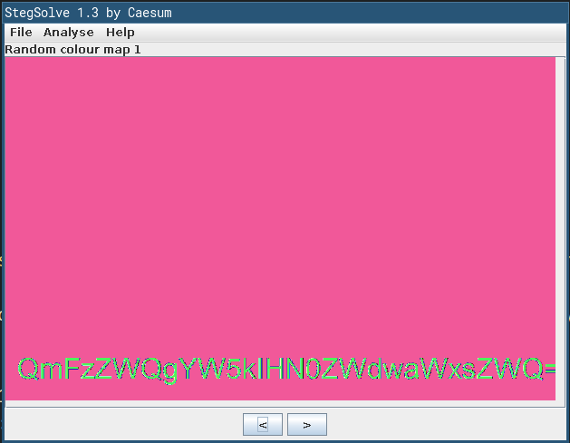

## BasedSteg \[80 pts.\]
>Steganography is the computer science of concealing or encrypting a message within a file, these are often found in ARG’s left by hackers. Find the message hidden within the image. https://tinyurl.com/baseencryption
>
>No flag formatting required.
_files: UNKNOWN2.png_

First, let's check the image with Stegsolve:

We can see a base64-encoded string so let's decode it. 
The flag is `Based and stegpilled`
