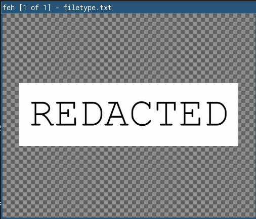

## Corrupt \[10 pts.\]
>Sometimes files can be disguised with a different file format! Find the password within this file.
>
>No flag formatting required.
_files: filetype.txt_

As the task description suggests, let's try
```
$ file filetype.txt
filetype.txt: PNG image data, 848 x 242, 8-bit/color RGBA, non-interlaced
```

Open the .txt file with any image viewer (i used `feh`):



And, the flag is `REDACTED`
