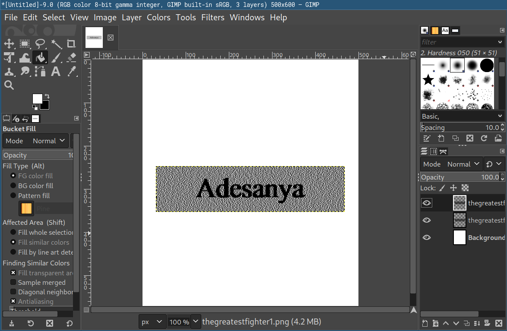

## TheGreatestFighter \[70 pts.\]
>There is something more to these two images…
>
>No flag formatting required.
_files: thegreatestfighter1.png thegreatestfighter1.png_

My first guess was to combine the images using Stegsolve, but that didn't work because the differences were in the alpha channel.

Next guess was to combine them in GIMP:

