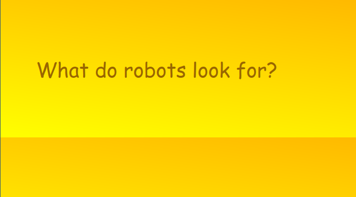
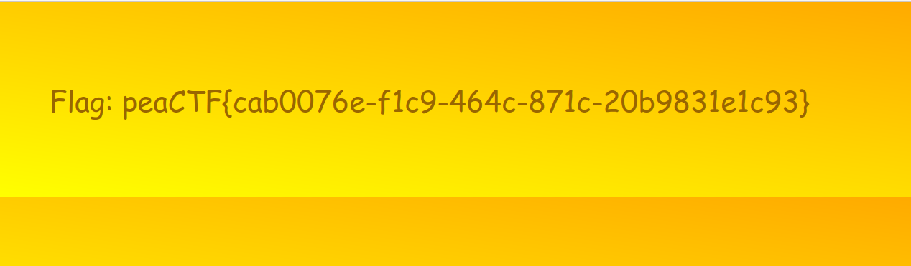

## Bots \[25 pts.\]
> What does a machine see?


Another web trivia challenge. What do robots look for?
Well, '/robots.txt':
```
User-agent: *
Sitemap: /sitemap.xml
```

This redirects us to `/sitemap.xml`:
```xml
<urlset>
<url>
<loc>/index.html</loc>
<lastmod>2019-04-10T09:51:57+06:00</lastmod>
</url>
<url>
<loc>/AZJ2sLVxnqM0RqLDWKeeUykaaUDsxElN.html</loc>
<lastmod>2019-04-10T09:51:57+06:00</lastmod>
</url>
</urlset>
```

And finally, `/AZJ2sLVxnqM0RqLDWKeeUykaaUDsxElN.html`:

