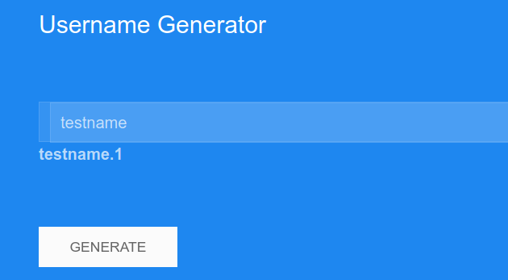
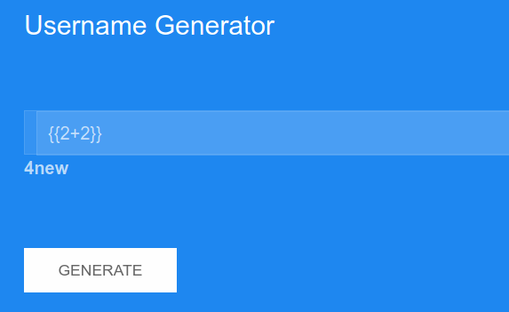
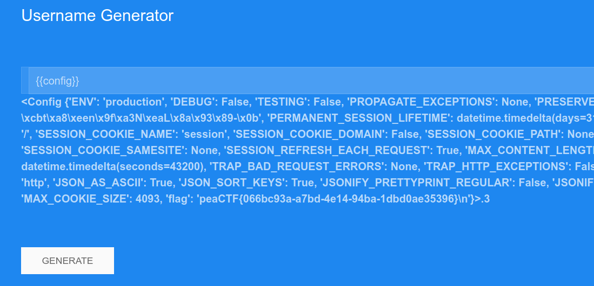

## flaskookies \[144 pts.\]
>You want to log in to a really cool username generator, but there doesn't seem to be a login page. What could the website possibly use to authenticate users?

As the title of the task suggests, this web service uses Flask, which means that it also uses Jinja2 as a template engine.

Let's try `{{2+2}}`:

It worked! Now let's see what the config is: `{{config}}`

And here's our flag!