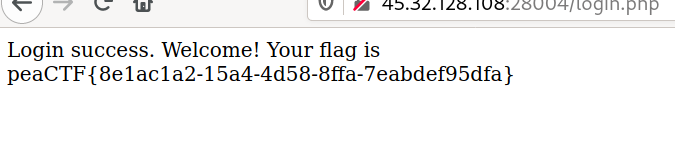

## Secure Admin 2 \[88 pts.\]
> This admin panel is now secured and hardened.

Again, we can try `admin` / `' OR 1=1;--`, but this time the server actually detects our SQLi attempt. I tried a couple of other variants, but with no luck.

What could we check out next? Cookies. And, there it is:

Looks like something interesting...

[CyberChef](https://ghcq.github.io/CyberChef) is awesome!

We can change the cookie to `admin:true` and get the flag.
My procedure was:
1. Get to `/login.php` through the login form
2. Change the cookie to `base64(base64("admin:true"))`
3. Reload the page
4. ????
5. PROFIT!

